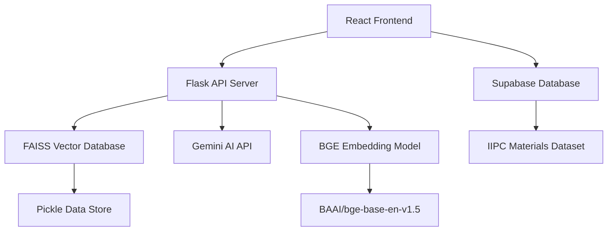

# IIPC Assistant


[](https://opensource.org/licenses/MIT)
[](https://www.python.org/downloads/)
[](https://reactjs.org/)
[](https://www.typescriptlang.org/)

> **AI-Powered Web Archiving Research Platform**
> 
> Explore conference materials, posters, videos transcripts, and presentations from the International Internet Preservation Consortium with intelligent search capabilities powered by advanced vector embeddings and generative AI.

## 🌟 Features

### 🔍 **Intelligent Search & Chat**
- **Semantic Search**: Find relevant materials using natural language queries
- **AI-Powered Responses**: Get contextual answers from IIPC conference materials
- **Real-time Chat Interface**: Interactive conversation with typing animations

### 📚 **Comprehensive Archive Access**
- **Multi-format Support**: Posters, presentations, videos transcripts, and research materials
- **Advanced Filtering**: Filter by year, type, author, and subject
- **Metadata Rich**: Full bibliographic information and descriptions
- **Direct Access**: Links to original materials via ARK URLs

### 🎨 **Modern User Experience**
- **Responsive Design**: Optimized for desktop, tablet, and mobile devices
- **Smooth Animations**: Polished interactions and transitions

### 🔧 **Technical Excellence**
- **Vector Database**: FAISS-powered similarity search
- **Modern Architecture**: React + TypeScript frontend, Flask backend
- **API Integration**: Gemini AI for response generation

## 📓 Data Pipeline Development

This project includes comprehensive Jupyter notebooks that demonstrate the complete data processing pipeline from raw IIPC materials to the final intelligent chatbot system.

### 🔄 **Data Harvesting Pipeline** (`harvest_iipc_metadata.ipynb`)

**Purpose:** Automated extraction of IIPC conference materials from UNT Digital Library

**Key Capabilities:**
- **OAI-PMH Protocol Integration**: Harvests metadata using Open Archives Initiative standards
- **Multi-format Content Processing**:
  - PDF text extraction with PyMuPDF and OCR fallback (Tesseract)
  - VTT transcript extraction for video materials
  - Intelligent file type detection and routing
- **Robust Data Collection**:
  - ARK URL persistence for long-term access
  - Complete metadata capture (title, creator, subject, description, dates)
  - Error handling for network failures and malformed data

**Technical Implementation:**
```python
# Example: OAI-PMH harvesting with resumption tokens
def harvest_oai_records():
    records = []
    token = None
    while True:
        params = {
            "verb": "ListRecords",
            "metadataPrefix": "oai_dc",
            "set": "collection:IIPCM"
        } if not token else {
            "verb": "ListRecords", 
            "resumptionToken": token
        }
        # Process records and handle pagination
```

**Results:** Successfully harvested 587 IIPC documents with full metadata and extracted content

### 🧠 **AI-Powered Text Enhancement** (`preprocess_iipc_data.ipynb`)

**Purpose:** Transform raw extracted text into structured, meaningful content using advanced AI

**Enhancement Pipeline:**
1. **Primary Text Cleaning**:
   - Normalization of line breaks and character encoding
   - Removal of OCR artifacts and formatting noise
   - Standardization of whitespace and punctuation

2. **AI-Powered Restructuring**:
   - Google Gemini 2.5 Flash-Lite integration for intelligent text processing
   - Conversion of slide presentations into readable narrative format
   - Preservation of technical terminology and context
   - Rate-limited processing (15 RPM) for API compliance

3. **Quality Assurance**:
   - Removal of AI-generated formatting artifacts
   - Content validation and integrity checks
   - Final cleanup of markdown and special characters

**Technical Implementation:**
```python
# Example: AI-enhanced text processing
def enhance_text_with_ai(text):
    response = model.generate_content(
        f"Make this text more meaningful and structured, "
        f"but don't summarize: {text[:8000]}"
    )
    return response.text.strip()
```

**Performance Metrics:**
- Processing rate: ~4.1 seconds per document (API rate limit compliance)
- Quality improvement: Structured presentations from raw OCR text

### 🤖 **Semantic Search & Chatbot Development** (`build_embeddings_and_chatbot.ipynb`)

**Purpose:** Create intelligent question-answering system with semantic search capabilities

**Advanced NLP Architecture:**
- **State-of-the-art Embeddings**: BAAI/bge-base-en-v1.5 model for superior semantic understanding
- **Intelligent Text Chunking**:
  - Token-aware chunking (450 tokens per chunk)
  - 50-token overlap for context preservation
  - Handles long documents exceeding model limits
- **Metadata Enrichment**: Combines title, creator, subject, and content for comprehensive context

**Vector Database Implementation:**
```python
# Example: Embedding generation and FAISS indexing
embeddings = model.encode(df['combined_text'].tolist())
index = faiss.IndexFlatL2(embeddings.shape[1])
index.add(embeddings.astype('float32'))

def retrieve_top_k(query, k=5):
    query_embedding = model.encode([query])
    distances, indices = index.search(query_embedding, k)
    return [data['combined_texts'][i] for i in indices[0]]
```

**RAG (Retrieval-Augmented Generation) System:**
- **Semantic Retrieval**: FAISS-powered similarity search for relevant document chunks
- **Context-Aware Generation**: Gemini AI provides responses grounded in retrieved content
- **Domain Expertise**: Specialized knowledge in web archiving, digital preservation, and IIPC topics

**Performance Specifications:**
- **Vector Dimensions**: 768-dimensional embeddings for rich semantic representation
- **Accuracy**: High precision through semantic similarity matching
- **Scalability**: Efficient handling of large document collections

### 🔬 **Technical Innovation Highlights**

**Multi-Modal Content Processing:**
- PDF documents with complex layouts and technical diagrams
- Video presentations with synchronized transcripts
- Mixed-format conference proceedings and research papers

**AI Integration Strategy:**
- **Text Enhancement**: Gemini 2.5 Flash-Lite for content restructuring
- **Response Generation**: Context-aware answers with hallucination prevention
- **Embedding Quality**: BAAI BGE model for superior semantic understanding

**Data Quality Assurance:**
- **Content Preservation**: Maintains original meaning while improving readability
- **Metadata Integrity**: Complete bibliographic information preservation
- **Error Handling**: Robust processing of imperfect OCR and extraction results

### 📊 **Pipeline Performance Metrics**

| Stage | Input | Output |
|-------|-------|--------|
| **Harvesting** | OAI-PMH Endpoint | 587 Raw Documents |
| **AI Enhancement** | Raw Text | Structured Content |
| **Embedding Generation** | Enhanced Text | Vector Database |
| **Chatbot Integration** | User Queries | AI Responses |

### 🛠️ **Development Environment Setup**

**Required Dependencies:**
```bash
# Data harvesting and processing
pip install requests beautifulsoup4 PyMuPDF pdf2image pytesseract
pip install pandas tqdm lxml

# AI and ML components  
pip install sentence-transformers transformers
pip install google-generativeai faiss-cpu
pip install numpy pickle5
```

**Environment Configuration:**
```bash
# Required API keys
export GEMINI_API_KEY="your_gemini_api_key"
export TESSERACT_CMD="/usr/bin/tesseract"  # Adjust path as needed
```

**Jupyter Extensions:**
```bash
# For enhanced notebook experience
pip install ipywidgets jupyter-widgets-base
jupyter nbextension enable --py widgetsnbextension
```

## 🏗️ Architecture



### **Frontend Stack**
- **React 18** with TypeScript for type safety
- **Tailwind CSS** for responsive styling
- **Vite** for fast development and building
- **Supabase** for PostgreSQL database and real-time features


### **Backend Stack**
- **Flask** web framework with CORS support
- **FAISS** for efficient vector similarity search
- **Google Gemini AI** for intelligent response generation
- **BAAI/bge-base-en-v1.5** for high-quality text embeddings
- **NumPy** for numerical operations

## 🚀 Quick Start

### Prerequisites

- Python 3.8 or higher
- Node.js 16 or higher
- npm or yarn package manager

### Installation

1. **Clone the repository**
   ```bash
   git clone https://github.com/Youssef-Sabri/iipc-assistant.git
   cd iipc-assistant
   ```

2. **Backend Setup**
   ```bash
   cd Backend
   
   # Create virtual environment
   python -m venv venv
   source venv/bin/activate  # On Windows: venv\Scripts\activate
   
   # Install dependencies
   pip install -r requirements.txt
   
   # Create environment file
   cp .env.example .env
   ```

3. **Configure Environment Variables**
   
   Edit `Backend/.env`:
   ```env
   GEMINI_API_KEY=your_gemini_api_key_here
   VITE_EMBEDDING_API_URL=your_embedding_api_url
   ```

4. **Frontend Setup**
   ```bash
   cd ../Frontend
   
   # Install dependencies
   npm install
   
   # Create environment file
   cp .env.example .env.local
   ```

5. **Configure Frontend Environment**
   
   Edit `Frontend/.env.local`:
   ```env
   VITE_CHAT_API_URL=http://localhost:5000
   VITE_SUPABASE_URL=your_supabase_project_url
   VITE_SUPABASE_ANON_KEY=your_supabase_anon_key
   ```

6. **Setup Database Schema**
   
   Create the following table in your Supabase database:
   ```sql
   CREATE TABLE iipc_materials (
     id SERIAL PRIMARY KEY,
     title TEXT,
     creator TEXT,
     date DATE,
     description TEXT,
     subject TEXT,
     item_type TEXT,
     ark_url TEXT,
     content TEXT,
     created_at TIMESTAMP DEFAULT NOW()
   );
   ```

### Running the Application

1. **Start the Backend Server**
   ```bash
   cd Backend
   source venv/bin/activate
   python app.py
   ```
   The API will be available at `http://localhost:5000`

2. **Start the Frontend Development Server**
   ```bash
   cd Frontend
   npm run dev
   ```
   The application will be available at `http://localhost:5173`

## 📁 Project Structure

```
iipc-assistant/
├── Backend/
│   ├── app.py                 # Flask application entry point
│   ├── embeddings.pkl         # Pre-computed vector embeddings
│   ├── requirements.txt       # Python dependencies
│   └── .env                   # Environment variables
├── Frontend/
│   ├── src/
│   │   ├── components/        # Reusable UI components
│   │   │   ├── chat/         # Chat-specific components
│   │   │   └── ui/           # Base UI components
│   │   ├── pages/            # Main application pages
│   │   │   ├── Index.tsx     # Home page
│   │   │   ├── Chat.tsx      # Chat interface
│   │   │   ├── About.tsx     # About IIPC page
|   |   |   ├── Browse.tsx    # Search materials
│   │   │   └── NotFound.tsx  # 404 error page
│   │   ├── hooks/            # Custom React hooks
│   │   │   └── use-iipc-data.ts # Supabase data hooks
│   │   ├── lib/              # Utility libraries
│   │   │   └── supabase.ts   # Supabase client configuration
│   │   └── assets/           # Static assets
│   ├── package.json          # Node.js dependencies
│   └── tailwind.config.js    # Tailwind CSS configuration
├── README.md                 # This file
└── banner.svg               # Project banner
```

## 🔧 Configuration

### Backend Configuration

The backend requires several environment variables:

| Variable | Description | Required |
|----------|-------------|----------|
| `GEMINI_API_KEY` | Google Gemini AI API key | ✅ |
| `VITE_EMBEDDING_API_URL` | BGE embedding model API endpoint | ✅ |

### Frontend Configuration

The frontend configuration is managed through environment variables:

| Variable | Description | Default |
|----------|-------------|---------|
| `VITE_CHAT_API_URL` | Backend API URL | `http://localhost:5000` |
| `VITE_SUPABASE_URL` | Supabase project URL | - |
| `VITE_SUPABASE_ANON_KEY` | Supabase anon/public key | - |

## 🧪 API Endpoints

### POST `/chat`

Send a query to the AI assistant and receive a contextual response.

**Request Body:**
```json
{
  "query": "What are the best practices for web crawling?"
}
```

**Response:**
```json
{
  "response": "Based on IIPC conference materials, here are the key best practices for web crawling..."
}
```

**Error Response:**
```json
{
  "error": "Query not provided"
}
```

## 📊 Data Processing

The system uses a hybrid approach combining Supabase for structured data and FAISS for vector search:

### **Database Schema (Supabase)**
```sql
CREATE TABLE iipc_materials (
  id SERIAL PRIMARY KEY,
  title TEXT,
  creator TEXT,
  date DATE,
  description TEXT,
  subject TEXT,
  item_type TEXT,
  ark_url TEXT,
  content TEXT,
  created_at TIMESTAMP DEFAULT NOW()
);
```

### **Vector Embeddings (FAISS)**
Pre-processed embeddings stored in `embeddings.pkl` containing:
- **embeddings**: NumPy array of vector representations using BAAI/bge-base-en-v1.5
- **combined_texts**: Corresponding text content with metadata

### **Embedding Process**

1. **Data Extraction**: Materials fetched from Supabase database
2. **Text Preparation**: Titles, descriptions, and content are combined
3. **Vectorization**: BAAI/bge-base-en-v1.5 model generates high-quality embeddings
4. **Indexing**: FAISS creates efficient searchable vector index

### **BGE Model Specifications**
- **Model**: BAAI/bge-base-en-v1.5
- **Embedding Dimension**: 768
- **Language**: English
- **Use Case**: Optimized for retrieval and semantic search tasks

## 🎨 UI/UX Design

### Design System

- **Color Palette**: Primary blue (`#3b82f6`) and research green (`#10b981`)
- **Typography**: System fonts with multiple weights
- **Spacing**: Consistent 4px grid system
- **Animations**: Smooth transitions and micro-interactions

### Responsive Breakpoints

- **Mobile**: `< 640px`
- **Tablet**: `640px - 1024px`
- **Desktop**: `> 1024px`

### Development Workflow

1. **Fork** the repository
2. **Create** a feature branch (`git checkout -b feature/amazing-feature`)
3. **Commit** your changes (`git commit -m 'Add amazing feature'`)
4. **Push** to the branch (`git push origin feature/amazing-feature`)
5. **Open** a Pull Request

## 📝 License

This project is licensed under the MIT License - see the [LICENSE](LICENSE) file for details.

## 🙏 Acknowledgments

- **International Internet Preservation Consortium (IIPC)** for providing the valuable archive materials
- **Google Gemini AI** for powerful language model capabilities
- **Beijing Academy of Artificial Intelligence (BAAI)** for the BGE embedding model
- **Supabase** for providing excellent database and real-time infrastructure
- **FAISS** team for efficient similarity search
- **Open Source Community** for the amazing tools and libraries
